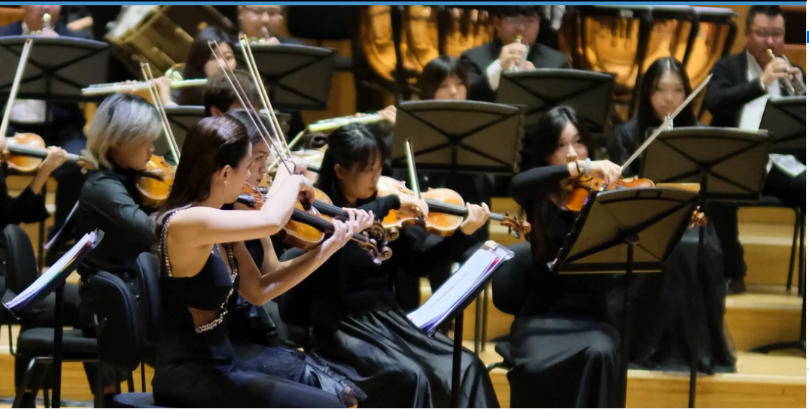
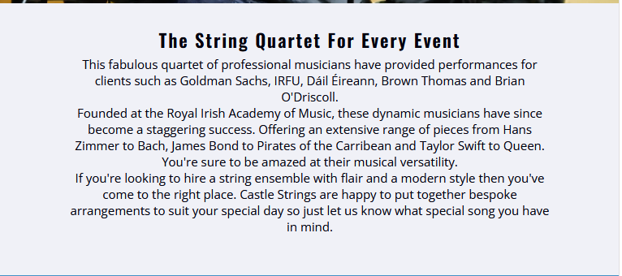
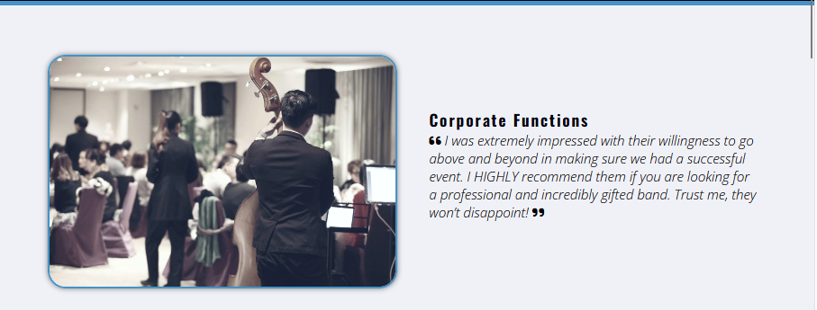
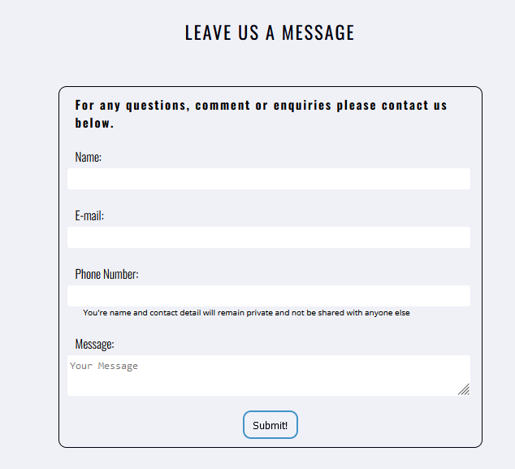

# Castle String Quartet

## Table of Contents
1. [Project Goals](#project-goals)
    1. [User Goals](#user-goals)
    2. [Site Owner Goals](#site-owner-goals)
2. [User Experience](#user-experience)
    1. [Target Audience](#target-audience)
    2. [User Requirements & Expectations](#user-requirements-and-expectations)
    3. [User Stories](#user-stories)
        1. [First Time User](#first-time-user)
        2. [Returning User](#returning-user)
        3. [Site Owner](#site-owner)
3. [Design](#design)
    1. [Design Choices](#design-choice)
    2. [Colour Pallette](#colour-pallette)
    3. [Fonts](#fonts)
    4. [Structure](#structure)
4. [Technologies Used](#technologies)
    1. [Languages](#langauges)
    2. [Frameworks & Tools](#frameworks--tools)
5. [Testing](#testing)
    1. [HTML Validation](#html-validation)
    2. [CSS Validation](#css-validation)
    3. [Accessibility](#accessibility)
    4. [Performance](#performance)
    5. [Device Testing](#device-testing)
    6. [Browser Compatibility](#browser-compatibility)
    7. [Testing User Stories](#testing-user-stories)
## Project Goals
### User Goals
- Find out about the members of the quartet.
- Find out what sort of music the quartet perform.
- Find information on the type of events the quartet perform at and/or offer.
- Get contact information of the quartet.

### Site Owner Goals
- Promote the business.
- Provide contact information to potential customers.
- Provide information to those who want to find out more about the quartet.
- Increase the amount of customers for the quartet.

## User Experience

### Target Audience
- People looking to find out more about the quartet.
- Companies hiring for corporate functions.
- Weddings.
- Private parties.

### User Requirements and Expectations
- Easily navigate through the website.
- Quickly find relevant information.
- Be able to quickly get in contact with the quartet.
- User accessibility.
- Site features work and are intuitive.
- Simple and pleasant aesthetic.

### User Stories

#### First-Time User
As a first-time user, I want to:
1. Know more about the quartet members.
2. Know what others think about the quartet.
3. Know what sort of music the quartet plays.
4. What type of events the quartet performs at.
5. Get in contact with the quartet.

#### Returning User
As a returning user, I want to:
1. Quickly get in contact with the quartet.
2. See the recent events the quartet performed at.
3. Find the quartet on social media.
4. Leave a message or suggestion for the quartet.

### Site Owner
As the site owner, I want to:
1. Provide information about the quartet to users.
2. Enable site users to get a good understanding on what the quartet likes to play.
3. Enable site user to quickly get in contact with the quartet.

## Design

### Design Choice
This webpage has been designed to be visually interesting and impart upon the readers the information required to get to know the violin quartet as potential customers or fans.

### Colour Pallette
The chosen colour pallette was chosen to appear clean and modern with inspiration from the BMW i series of cars. All colours were felt to contrast well and compliment each other by including some blue.
 
The three colours used are shown on the pallette below.
<figure>
    
    <figcaption>The colour pallette used for the website</figcaption>
</figure>

### Fonts
The "Oswald" font was used for headings.
 
The "Open Sans" font was used for bodies of text as it is considered complimentary to "Oswald".

### Structure
The website structure was kept simple for the ease of navigation. Upon landing on the website the user 
is first met with a nav-bar to easily traverse the website, a recognisable logo to help the users confirm they have found the correct site and a hero-image of the quartet who they want to know more about and may recognise from an event the user user may have attended. A common header and footer is used across the site to provide a consistent UI experience for the user.
 
The site is spread across three separate pages:
  - An extended home-page which includes a hero-image, samples of the band playing, what types of events the quartet plays at & information on the quartet's players.
  - A gallery page containing videos and images of the quartet.
  - A contact page to allow the user to quickly get in contact with the quartet.

### Wireframes

Home-Page

    <figure>
        
        <figcaption>A wireframe for the home page on mobile, tablet & browser</figcaption>
    </figure>

Media-Page

    <figure>
        
        <figcaption>A wireframe for the media or gallery page on mobile, tablet & browser</figcaption>
    </figure>

About-Page

    <figure>
        
        <figcaption>A wireframe for the about page on mobile, tablet & browser</figcaption>
    </figure>

Contact-Page

    <figure>
        
        <figcaption>A wireframe for the contact page on mobile, tablet & browser</figcaption>
    </figure>

## Technologies

### Langauges
 - CSS
 - HTML

### Frameworks & Tools
- Git 
- GitHub
- GitPod
- Balsamiq
- Google Fonts
- Awesome Fonts
- Pexels
- Unsplash

## Features
This website consists of 3 pages, including # differnt features

### Logo and Navigation Bar
 - The three webpages share a common header.
 - The logo and name are displayed to confirm the user is on the correct site.
 - A nav-bar is provided for quick navigation throughout the website.
 - The current webpage is highlighted within the nav-bar.
<figure>
    
</figure>

### Footer
- Common across all three pages
- Three sections: Social Media Link, Contact Information, A logo linking back to the home-page.
<figure>
    
</figure>

### Hero-Image
- Introduces the user to the quartet.
<figure>
    
</figure>

### Blurb
- Provides some general background information on the quartet.
<figure>
    
</figure>

### Performances
- Displays some past performances by the band to the users.
<figure>
    
</figure>

### Functions
- Describes to the user the type of events the quartet plays for.
- Provides reviews from previous patrons for each event type.
<figure>
    
</figure>

### Player Information
- Provides more information on the background of each of the quartet's members.
<figure>
    
</figure>

### Contact Form
- Allow the user to quickly get in contact with the quartet.
- User can provide their own contact details to allow the quartet to respond.
- Users can leave messages or reviews for the quartet.
<figure>
    
</figure>

### Gallery
- Imagery of the quartet's events and locations.
<figure>
    
</figure>

## Testing
### HTML Validation
The W3C validation service was used to validate the html of all three webpages.

### CSS Validation
The W3C Jigsaw CSS validation service is used to validate the sites CSS styling.

### Accessibility
The WAVE WebAIM web accessibility evaluation tool is used to ensure each page is highly accessible.

### Performance
Google Lighthouse, found in Google Chrome Dev tools was used to test the performance of the site.

### Device Testing
The following devices were used to test the site:

### Browser Compatibility
The following devicese were used to test the site:

### Testing User Stories

## Bugs
| **Bug** | **Fix** |
| ----------- | ----------- |
| About link in header of Gallery and Contact did not link back to Index | Change href to link to about section of Index |
| h3 elements in footer of gallery/contact when no h2 was present on page | Changed to h2 for improved accessibility |

## Deployment

## Credits
Uncredited images have been provided for use by Castle String Quartet
### Images
2. [hero-image-1](assets/images/hero-image-1.webp):Photo by <a href="https://www.pexels.com/@cottonbro/">cottonbro</a> on <a href="https://www.pexels.com/">Pexels</a>.
2. [hero-image-2](assets/images/hero-image-2.webp):Photo by <a href="https://unsplash.com/@hellokian">kian zhang
</a> on <a href="https://unsplash.com/">Unsplash</a>.
3. [hero-image-4](assets/images/hero-image-4.webp): Photo by <a href="https://www.pexels.com/@goumbik/">Lukas</a> on <a href="https://www.pexels.com/">Pexels</a>.
4. [performance-video-1](https://www.youtube.com/watch?v=i2nsvMQvw60&t=5s): Video by <a href="http://www.stringspace.com.au/">The Stringspace Quartet</a>.
5. [performance-video-2 ](https://www.youtube.com/watch?v=es_3F3TLJS0&t=2s): Video by <a href="www.theweddingstringquartet.com">The Wedding String Quartet</a>.
6. [corporate-function ](assets/images/corp-function.webp):Photo by <a href="https://www.pexels.com/@pietrozj/">Pietro Jeng</a> on <a href="https://www.pexels.com/">Pexels</a>.
7. [party](assets/images/party.webp):Photo by <a href="https://www.pexels.com/@expect-best-79873/">Expect Best</a> on <a href="https://www.pexels.com/">Pexels</a>.
8. [wedding](assets/images/wedding.webp):Photo by <a href="https://www.pexels.com/@asadphotography/">Asad Photo Maldives</a> on <a href="https://www.pexels.com/">Pexels</a>.
9. [player-1](assets/images/player-1.webp):Photo by <a href="https://www.pexels.com/@helen1/">Helena Jankovičová Kováčová</a> on <a href="https://www.pexels.com/">Pexels</a>.
10. [player-2](assets/images/player-2.webp):Photo by <a href="https://unsplash.com/@vidarnm">Vidar Nordli-Mathisen</a> on <a href="https://unsplash.com/">Unsplash</a>.
11. [player-3](assets/images/player-3.webp):Photo by <a href="https://unsplash.com/@grimalkin">Lena Grimalkin</a> on <a href="https://unsplash.com/">Unsplash</a>.
12. [player-4](assets/images/player-4.webp):Photo by <a href="https://www.pexels.com/@cottonbro/">cottonbro</a> on <a href="https://www.pexels.com/">Pexels</a>.
13. [candles](assets/images/candles.webp): Photo by <a href="pexels.com/@irina-anastasiu-10540/">Irina Anastasiu</a> on <a href="https://www.pexels.com/">Pexels</a>.
14. [candles](assets/images/choir.webp): Photo by <a href="https://www.pexels.com/@blue-ox-studio-218748/">Blue Ox Studio</a> on <a href="https://www.pexels.com/">Pexels</a>.
15 . [player-4](assets/images/strings.webp):Photo by <a href="https://www.pexels.com/@cottonbro/">cottonbro</a> on <a href="https://www.pexels.com/">Pexels</a>.