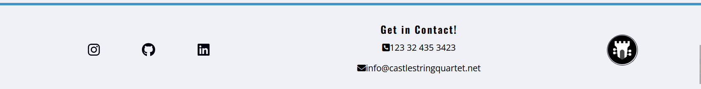
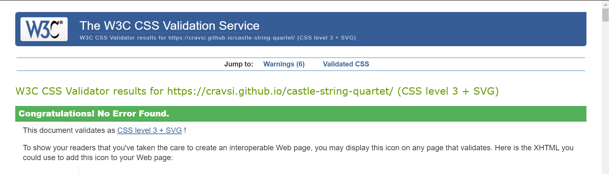
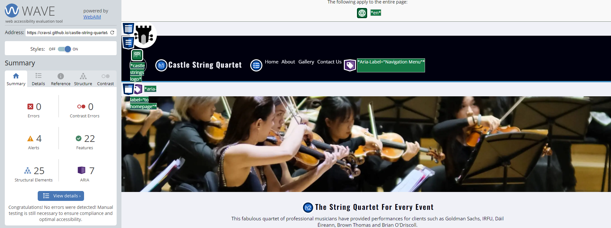
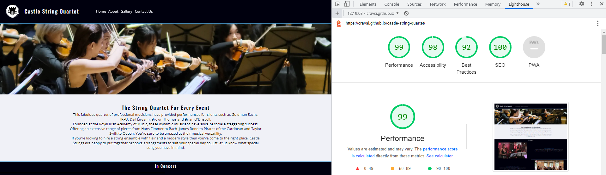

# Castle String Quartet

For my **Portfolio Project 1** on **Code Institute's 5 Project Course** I have created this informational website focused on being the go to site for a the Castle String Quartet. Here users can find out more about the quartet and find the groupd contact information.

Link to deployed [site](https://cravsi.github.io/castle-string-quartet/).

Link to Github [repository](https://github.com/Cravsi/castle-string-quartet).

## Table of Contents
- [Castle String Quartet](#castle-string-quartet)
  * [Table of Contents](#table-of-contents)
  * [Project Goals](#project-goals)
    + [User Goals](#user-goals)
    + [Site Owner Goals](#site-owner-goals)
  * [User Experience](#user-experience)
    + [Target Audience](#target-audience)
    + [User Requirements and Expectations](#user-requirements-and-expectations)
    + [User Stories](#user-stories)
  * [Design](#design)
    + [Design Choice](#design-choice)
    + [Colour Palette](#colour-palette)
    + [Fonts](#fonts)
    + [Structure](#structure)
    + [Wireframes](#wireframes)
  * [Technologies](#technologies)
    + [Langauges](#langauges)
    + [Frameworks & Tools](#frameworks---tools)
  * [Features](#features)
    + [Logo and Navigation Bar](#logo-and-navigation-bar)
    + [Footer](#footer)
    + [Hero-Image](#hero-image)
    + [Blurb](#blurb)
    + [Performances](#performances)
    + [Functions](#functions)
    + [Player Information](#player-information)
    + [Contact Form](#contact-form)
    + [Gallery](#gallery)
  * [Testing](#testing)
    + [HTML Validation](#html-validation)
    + [CSS Validation](#css-validation)
    + [Accessibility](#accessibility)
    + [Performance](#performance)
    + [Device Testing](#device-testing)
    + [Browser Compatibility](#browser-compatibility)
    + [Testing User Stories](#testing-user-stories)
  * [Bugs](#bugs)
  * [Version Control](#version-control)
    + [Git and Github](#git-and-github)
    + [Deployment](#deployment)
  * [Credits](#credits)
    + [Images](#images)
## Project Goals
### User Goals
- Find out about the members of the quartet.
- Find out what sort of music the quartet performs.
- Find information on the type of events the quartet performs at and/or offer.
- Find the contact information of the quartet.
 

### Site Owner Goals
- Promote the business.
- Provide contact information to potential customers.
- Provide information to inquiring about the quartet.
- Increase the amount of customers for the quartet.
 

## User Experience

### Target Audience
- People looking to find out more about the quartet.
- Companies hiring for corporate functions.
- Weddings parties.
- Private parties.
 

### User Requirements and Expectations
- Easily navigate through the website.
- Quickly find relevant information.
- Be able to quickly get in contact with the quartet.
- User accessibility.
- Site features work and are intuitive.
- Simple and pleasant aesthetic.
 

### User Stories

#### First-Time User
1. As a first-time user, I want to know more about the quartet members.
2. As a first-time user, I want to know what others think about the quartet.
3. As a first-time user, I want to know what sort of music the quartet plays.
4. As a first-time user, I want to know what type of events the quartet performs.
5. As a first-time user, I want to get in contact with the quartet.
 

#### Returning User
6. As a returning user, I want to quickly get in contact with the quartet.
7. As a returning user, I want to see the recent events the quartet performed at.
8. As a returning user, I want to find the quartet on social media.
9. As a returning user, I want to leave a message or suggestion for the quartet.
 

#### Site Owner
10. As the site owner, I want to provide information about the quartet to users.
11. As the site owner, I want to demonstrate to users the type of performances the quartet offers.
12. As the site owner, I want to provide contact information to the users.
 

## Design

### Design Choice
This webpage has been designed to be visually interesting and provide the readers the information required for them to feel they know enough about the violin quartet as fans or potential customers.
 

### Colour Palette
The chosen colour palette was appears clean and modern, with inspiration from the BMW i series of cars. All colours were felt to contrast well and compliment each other by including shades blue.
 
The three colours used are shown on the palette below.
<figure>
    
    <figcaption>The colour palette used for the website</figcaption>
</figure>
 

### Fonts
The *Oswald* font was used for headings.
 
The *Open Sans* font was used for bodies of text as it is considered complimentary to *Oswald*.
 

### Structure
The website structure was kept simple for the ease of navigation. Upon landing on the website the user 
is first met with a nav-bar to easily traverse the website, a recognisable logo to help the users confirm they have found the correct site and a hero-image of the quartet, who they may recognise from an event the user user may have attended. A common header and footer is used to provide navigation & media links to the user.
 
The site is spread across one page with multiple sections:

- An home section which includes a hero-image, a short descriptive blurb and a performance section.
- An about section which contains information on the events the quartet accommodates and information on wach of the players.
- A gallery section containing images of the quartet.
- A contact section to allow the user to quickly get in contact with the quartet.
 

### Wireframes
Initially the site was designed to include four pages. This was changed during the project to be a one-page layout, wireframes for mobile, tablet & browser layouts can be seen in "One-Page Layout". 

 <b>One-Page Layout</b> 

    <figure>
        
        <figcaption>A wireframe for the one-page layout on mobile, tablet & browser</figcaption>
    </figure>

 

The wireframes prior to the layout redesign have been included below.

Home-Page

    <figure>
        
        <figcaption>A wireframe for the home page on mobile, tablet & browser</figcaption>
    </figure>

Media-Page

    <figure>
        
        <figcaption>A wireframe for the media or gallery page on mobile, tablet & browser</figcaption>
    </figure>

About-Page

    <figure>
        
        <figcaption>A wireframe for the about page on mobile, tablet & browser</figcaption>
    </figure>

Contact-Page

    <figure>
        
        <figcaption>A wireframe for the contact page on mobile, tablet & browser</figcaption>
    </figure>

 

## Technologies

### Langauges
 - CSS
 - HTML
  

### Frameworks & Tools
- [Git](https://git-scm.com/) 
- [GitHub](https://github.com/Cravsi/)
- [GitPod](https://www.gitpod.io/)
- [Balsamiq](https://balsamiq.com/)
- [Google Fonts](https://fonts.google.com/)
- [Awesome Fonts](https://fontawesome.com/)
- [Pexels](https://www.pexels.com/)
- [Unsplash](https://unsplash.com/)
- [TinyPNG](https://tinypng.com/)
- [Convertio](https://convertio.co/jpg-webp/)
 

## Features
This website consists of 1 page, with multiple section:
 

### Logo and Navigation Bar
 - The logo and name are displayed to confirm the user is on the correct site.
 - A nav-bar is provided for quick navigation throughout the website.
 - The current webpage is highlighted within the nav-bar.
<figure>
    
</figure>

### Footer
- Three sections: Social Media Link, Contact Information, A logo linking back to the home section.
<figure>
    
</figure>

### Hero-Image
- Introduces the user to the quartet.
<figure>
    
</figure>

### Blurb
- Provides some general background information on the quartet.
<figure>
    
</figure>

### Performances
- Displays some past performances by the band to the users.
<figure>
    
</figure>

### Functions
- Describes to the user the type of events the quartet plays for.
- Provides reviews from previous patrons for each event type.
<figure>
    
</figure>

### Player Information
- Provides more information on the background of each of the quartet's members.
<figure>
    
</figure>

### Contact Form
- Allow the user to quickly get in contact with the quartet.
- User can provide their own contact details to allow the quartet to respond.
- Users can leave messages or reviews for the quartet.
<figure>
    
</figure>

### Gallery
- Imagery of the quartet's events and locations.
<figure>
    
</figure>

### Future Features
- A scroll spy to display to the user which section they are viewing by moving an active class between the menu items.
- An image carousel to display to the user multiple images where current hero-image is located.
 

## Testing
### HTML Validation
The W3C validation service was used to validate the html of the webpage. No errors were detected.

HTML Validation

    <figure>
        
    </figure>

 

### CSS Validation
The W3C Jigsaw CSS validation service is used to validate the sites CSS styling. No errors were found.

HTML Validation

    <figure>
        
    </figure>

 

### Accessibility
The WAVE WebAIM web accessibility evaluation tool is used to ensure each page is highly accessible.

Accessibility

    <figure>
        
    </figure>

 

### Performance
Google Lighthouse, found in Google Chrome Dev tools was used to test the performance of the site.

Lighthouse Desktop Performance

    <figure>
        
    </figure>

Lighthouse Mobile Performance

    <figure>
        
    </figure>

 

### Local Testing
- Logo
    - Logo remains clearly visible down to a screen width of 280px.
    - Clicking on the logo return the user to the top of the page.
- Header & Navigation Bar
    - Header remains positioned at the top of the screen regardless of where the user scrolls.
    - Site name remains clearly visible down to a screen width of 280px.
    - That when the user clicks on the nav bar links the page scrolls to the correct section.
- Blurb
    - That the heading remains clearly legigble and visible at all screen sizes to a minimum of 280px.
    - That the blurb text body remains clearly legigble and visible at all screen sizes to a minimum of 280px.
- Information Section 
    - Section formats correctly above screen widths of 786px.
    - All information clearly visible above 786px.
    - Section formats correctly below 786px.
    - All information clearly visible below 786px.
    - Images scale properly at all screen widths.
- Gallery
    - Images display correctly at all widths down to a minimum of 280px.
    - Images animate correctly when hovered over.
    - Images open into a new tab when clicked on.
- Contact Form
    - Form displayed correctly at all screen widths to a minimum of 280px.
    - Required information must be input before form can be submitted.
    - Submit button is displayed correctly at all screen widths
    - Submit button animates correctly when hovered over.
    - Submit button sends data to correct address. (CodeInsitute form dump)
    - All inputs require the expected data types i.e. emails / text. 
- Footer
    - Footer information remains clearly visible at all screen widths to a minimum of 280px.
    - All links work correctly.

Fixes after local testing.

| **Bug** | **Fix** |
| ----------- | ----------- |
| menu unclear under when width < 372px | changed menu justification to space-around |
| footer contact link redundant due to one-page design | removed |
| submit button returned data in same tab as site | added formtarget=_blank to open new tab |

 

### Device Testing
In addition to various devices resolutions being testing through the **Responsive Design Mode** tool in Mozilla Firefox the following devices were used to test the site:
- Moto G8           [720x1560px]
- Oppo AX7          [1080x2340px]
- iPhone 13         [1170x2532px]
- iPhone 8          [667x375px]
- iPhone XR         [828x1792px]
- Galaxy Note 20    [1080x2400px]
- OnePlus Nord 2    [1080x2400px]

The website performed well on all these devices. No unexpected errors were found and responsiveness was good.
 

### Browser Compatibility
The following devicese were used to test the site:
- Mozilla Firefox
- Google Chrome
- Microsoft Edge
The website performed well on all these browsers. No unexpected errors were found and responsiveness was good.
 

### Testing User Stories
- 1. As a first-time user, I want to know more about the quartet members.
- 10. As the site owner, I want to provide information about the quartet to users.
 

| **Feature** | **Action** | **Expected Result** | **Result** |
| ----- | ----- | ----- | ----- |
| About Section | Click on the *About* link in the nav-bar | Find information about the quartet | Works as expected |
| Gallery Section | Click on the *Gallery* link in the nav-bar | Find images of the quartet | Works as expected |

Screenshots

    <figure>
        
    </figure>
    <figure>
        
    </figure>

 

- 2. As a first-time user, I want to know what others think about the quartet.

| **Feature** | **Action** | **Expected Result** | **Result** |
| ----- | ----- | ----- | ----- |
| Reviews | Navigate to about section, scroll through functions | Read through reviews for each section | Works as expected |

Screenshots

    <figure>
        
    </figure>

 

- 3. As a first-time user, I want to know what sort of music the quartet plays.
- 4. As a first-time user, I want to know what type of events the quartet performs.
- 11. As the site owner, I want to demonstrate to user the type of performances the quartet offers.

| **Feature** | **Action** | **Expected Result** | **Result** |
| ----- | ----- | ----- | ----- |
| Performance Section | Navigate to the performance section | Watch performance videos | Works as expected |

Screenshots

    <figure>
        
    </figure>
    <figure>
        
    </figure>

 

- 5. As a first-time user, I want to get in contact with the quartet.
- 6. As a returning user, I want to quickly get in contact with the quartet.
- 9. As a returning user, I want to leave a message or suggestion for the quartet.
- 12. As the site owner, I want to provide contact information to the users.

| **Feature** | **Action** | **Expected Result** | **Result** |
| ----- | ----- | ----- | ----- |
| Contact Section | Navigate to footer, find contact information | Find contact information | Works as expected|
| Contact Form | Navigate to contact form, submit form | Submit contact details and message | Works as expected |

Screenshots

    <figure>
        
    </figure>

 

- 7. As a returning user, I want to see the recent events the quartet performed at.
- 8. As a returning user, I want to find the quartet on social media.

| **Feature** | **Action** | **Expected Result** | **Result** |
| ----- | ----- | ----- | ----- |
| Social media links | Navigate to footer, click on social media links | User views latest social media posts | Works as expected |

Screenshots

    <figure>
        
    </figure>

 

## Bugs
| **Bug** | **Fix** |
| ----------- | ----------- |
| About link in header of Gallery and Contact did not link back to Index | Change href to link to about section of Index |
| h3 elements in footer of gallery/contact when no h2 was present on page | Changed to h2 for improved accessibility |
| Player images continued scaling to take up most of the screen | Set max-width image containers |
 

## Version Control
### Git and Github
Repository created on Github. 
Method:
- Create new public repository on Gitpod using the CodeInstitiute template.
- Open a Gitpod workspace.
- Create required folders and documents.
- Project was previewed using the liveserver port on a the Firefox browser.
- Work was continuosly saved and committed using the following git commands:
    - **git add .** to stage changes to git.
    - **git commit -m** to commit changes
    - **git push** to push changes to Github repo.
 

### Deployment
The site was deployed using Github Pages using the following steps:
 1. In the github repository open repository **settings**.
 2. In setting open **pages** tab.
 3. Select branch **main** as source.
 4. **Save** selection to deploy the site.
 5. Open the deployed site using the link provided on the screen.

Steps to deploy site on Github Pages

    <figure>
        
    </figure>

 

### Fork
A copy of the original repository can be created by forking it. This will allow changes to be made to the cloned repo without it affecting the original.

1. From within the repo you want to fork click the **fork** button.
2. Input the name and description of your cloned repo and click the **Create fork** button.

Steps to fork a repository

    <figure>
        
    </figure>

 

### Clone
Cloning a repo allows you to make local changes to the repository before committing and pushing them to the remote.

1. From within the repo you want to clone click the dropdown **Code** button.
2. Click on the clipboard icon to copy the URL.
3. In Git Bash, navigate to the working directory you want to place the clone.
4. Type `git clone` followed by the copied URL.
5. Press `Enter` and the clone will be created. 

Steps to clone a repository

    <figure>
        
    </figure>

 

## Credits
Uncredited images have been provided for use by Castle String Quartet
### Images
2. [hero-image-1](assets/images/hero-image-1.webp):Photo by <a href="https://www.pexels.com/@cottonbro/">cottonbro</a> on <a href="https://www.pexels.com/">Pexels</a>.
2. [hero-image-2](assets/images/hero-image-2.webp):Photo by <a href="https://unsplash.com/@hellokian">kian zhang
</a> on <a href="https://unsplash.com/">Unsplash</a>.
3. [hero-image-4](assets/images/hero-image-4.webp): Photo by <a href="https://www.pexels.com/@goumbik/">Lukas</a> on <a href="https://www.pexels.com/">Pexels</a>.
4. [performance-video-1](https://www.youtube.com/watch?v=i2nsvMQvw60&t=5s): Video by <a href="http://www.stringspace.com.au/">The Stringspace Quartet</a>.
5. [performance-video-2 ](https://www.youtube.com/watch?v=es_3F3TLJS0&t=2s): Video by <a href="www.theweddingstringquartet.com">The Wedding String Quartet</a>.
6. [corporate-function ](assets/images/corp-function.webp):Photo by <a href="https://www.pexels.com/@pietrozj/">Pietro Jeng</a> on <a href="https://www.pexels.com/">Pexels</a>.
7. [party](assets/images/party.webp):Photo by <a href="https://www.pexels.com/@expect-best-79873/">Expect Best</a> on <a href="https://www.pexels.com/">Pexels</a>.
8. [wedding](assets/images/wedding.webp):Photo by <a href="https://www.pexels.com/@asadphotography/">Asad Photo Maldives</a> on <a href="https://www.pexels.com/">Pexels</a>.
9. [player-1](assets/images/player-1.webp):Photo by <a href="https://www.pexels.com/@helen1/">Helena Jankovičová Kováčová</a> on <a href="https://www.pexels.com/">Pexels</a>.
10. [player-2](assets/images/player-2.webp):Photo by <a href="https://unsplash.com/@vidarnm">Vidar Nordli-Mathisen</a> on <a href="https://unsplash.com/">Unsplash</a>.
11. [player-3](assets/images/player-3.webp):Photo by <a href="https://unsplash.com/@grimalkin">Lena Grimalkin</a> on <a href="https://unsplash.com/">Unsplash</a>.
12. [player-4](assets/images/player-4.webp):Photo by <a href="https://www.pexels.com/@cottonbro/">cottonbro</a> on <a href="https://www.pexels.com/">Pexels</a>.
13. [candles](assets/images/candles.webp): Photo by <a href="pexels.com/@irina-anastasiu-10540/">Irina Anastasiu</a> on <a href="https://www.pexels.com/">Pexels</a>.
14. [candles](assets/images/choir.webp): Photo by <a href="https://www.pexels.com/@blue-ox-studio-218748/">Blue Ox Studio</a> on <a href="https://www.pexels.com/">Pexels</a>.
15 . [player-4](assets/images/strings.webp):Photo by <a href="https://www.pexels.com/@cottonbro/">cottonbro</a> on <a href="https://www.pexels.com/">Pexels</a>.